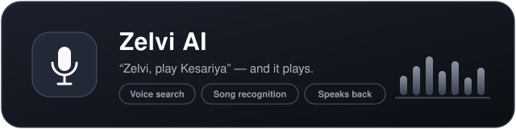

<p align="center">
  
</p>

<h1 align="center">Zelvi</h1>

<p align="center">
  <strong>One music app. YouTube + your own MP3s + podcasts — with a recommendation engine that learns your taste.</strong><br/>
  <sub>By ROXLI · Zelvi Studio</sub>
</p>

<div align="center">
  <a href="#-download"></a>
  <a href="#-download"></a>
  <a href="#-download"></a>
  <br/><br/>
  <a href="https://zelvi-sarvam.roxli.in/download">
    
  </a><br/>
  <sub>Latest <b>v1.2.0</b> · Free · No sign-up · Updates inside the app</sub>
</div>

---

##  Zelvi AI — your voice is the remote

<div align="center">
  
</div>

- 🗣️ **Voice search** — say *"Zelvi, play Kesariya"* and it plays. No typing.
- 🔍 **Song recognition** — Shazam-style: play any song around you, Zelvi names it and queues it.
- 🔊 **Speaks back** — Zelvi confirms out loud in a natural voice (Hindi & English).

##  Everything in one player

| | |
|---|---|
|  **YouTube + your MP3s + podcasts** | One library, one player — paste any YouTube link or song name |
|  **Learns your taste** | Deity-aware & mood-aware recommendations that improve with every play *and* skip |
|  **Bhajan radio** | Endless radio tuned to your devotional mood — Khatu Shyam, Radha-Krishna, Shiv, Sai and more |
|  **Offline downloads** | Real audio downloads with progress — songs play with no internet |
|  **Background & lock-screen** | Native playback engine with lock-screen card, media controls and true screen-off playback |
|  **Instant start** | Streams are pre-resolved *before* you tap — no more 5–10 second waits |
|  **In-app updates** | New version? Zelvi tells you and updates straight from GitHub Releases |
|  **Dark & light themes** | A clean, fast UI that feels native on every device |

##  The taste engine

Zelvi builds a taste profile from what you play, what you search and — importantly — what you **skip**:

<p align="center">
  <code>Khatu Shyam</code> <code>Radha-Krishna</code> <code>Shiv</code> <code>Ram-Hanuman</code> <code>Mata Devi</code> <code>Ganesh</code> <code>Sai</code><br/>
  <code>Sad</code> <code>Romantic</code> <code>Party</code> <code>Punjabi</code> <code>Haryanvi</code> <code>Rajasthani</code> <code>Retro</code>
</p>

Play a Khatu Shyam bhajan and the radio stays in the same devi-devta mood — it won't drift into random songs. Your profile stays **on your device** and fades gently over time, so recommendations follow who you are today.

##  Download

| Platform | Direct file (v1.2.0) |
|---|---|
| 🤖 **Android** | [zelvi-android-v1.2.0.apk](https://github.com/zelvi-roxli/zelvi/releases/download/v1.2.0/zelvi-android-v1.2.0.apk) — install (allow "install unknown apps" once) |
| 🪟 **Windows** | [zelvi-windows-v1.2.0-setup.exe](https://github.com/zelvi-roxli/zelvi/releases/download/v1.2.0/zelvi-windows-v1.2.0-setup.exe) — run the installer |
| 🍎 **macOS** | [zelvi-macos-v1.2.0.dmg](https://github.com/zelvi-roxli/zelvi/releases/download/v1.2.0/zelvi-macos-v1.2.0.dmg) — drag to Applications (Apple Silicon) |

> All releases live in the [**Releases**](https://github.com/zelvi-roxli/zelvi/releases) section, or on the web at
> **[zelvi-sarvam.roxli.in/download](https://zelvi-sarvam.roxli.in/download)** — the page always serves the latest version.

##  Install notes

- **Android** — first install asks for *install unknown apps* permission; allow it once for your browser, then open the APK.
- **Windows** — SmartScreen may show once — "More info → Run anyway".
- **macOS** — if macOS says *"Zelvi is damaged and can't be opened"*, that's Gatekeeper (the app isn't notarized), not real damage. One-time fix — open Terminal and run:
  ```bash
  xattr -cr /Applications/Zelvi.app
  ```
  (or System Settings → Privacy & Security → **Open Anyway**). Then Zelvi opens normally.
- **Updates** — installed already? Zelvi shows an update banner by itself; no need to revisit this page.

##  FAQ

<details>
<summary><b>Is Zelvi free?</b></summary>
Yes — every feature, every platform, no account needed.
</details>

<details>
<summary><b>Why isn't Zelvi on the Play Store?</b></summary>
Zelvi downloads audio for offline listening, which store policies don't allow — so it's distributed directly. Updates are delivered inside the app.
</details>

<details>
<summary><b>Does my data leave my device?</b></summary>
Your library, taste profile and downloads stay on your device. Voice commands go through a secure proxy so no API keys are ever stored in the app.
</details>

##  Under the hood

<details>
<summary><b>Tech stack</b></summary>

- **Monorepo** — pnpm + Turborepo
- **Web** — React + Vite PWA
- **Android** — Capacitor shell with a native Media3/ExoPlayer engine + NewPipeExtractor resolver
- **Desktop** — Electron with auto-update
- **AI** — Sarvam voice (STT/TTS) through a private server-side proxy, taste engine with TF-IDF similarity & daily decay

</details>

##  Home

[roxli.in](https://roxli.in) · A product of ROXLI · Zelvi Studio
